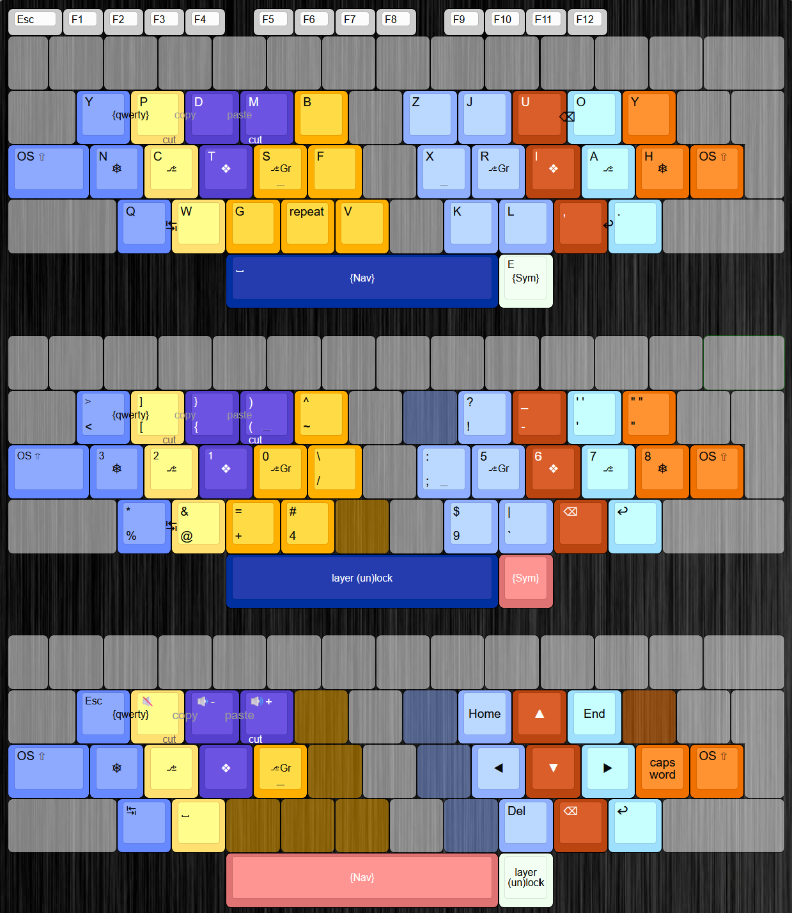

# NeonAKL
Neon is a keyboard layout originally by Turtlyn, adapted to kanata by Samuel / Borrasca.

```
    y p d m b  z j u o y 
OS⇧ n c t s f  x r i a h OS⇧
     q w g ★ v  k l , . 
         ␣        e
```

Notes:\
• thumb e\
• mirrored Y\
• index repeat key\
• one shot shift on pinkies\
• home row mods\
• combos for backspace, tab and enter on base layer\
• combos for qwerty layer, cut, copy and paste on all layers\
• custom sym layer with tap-holds for shifted keys


