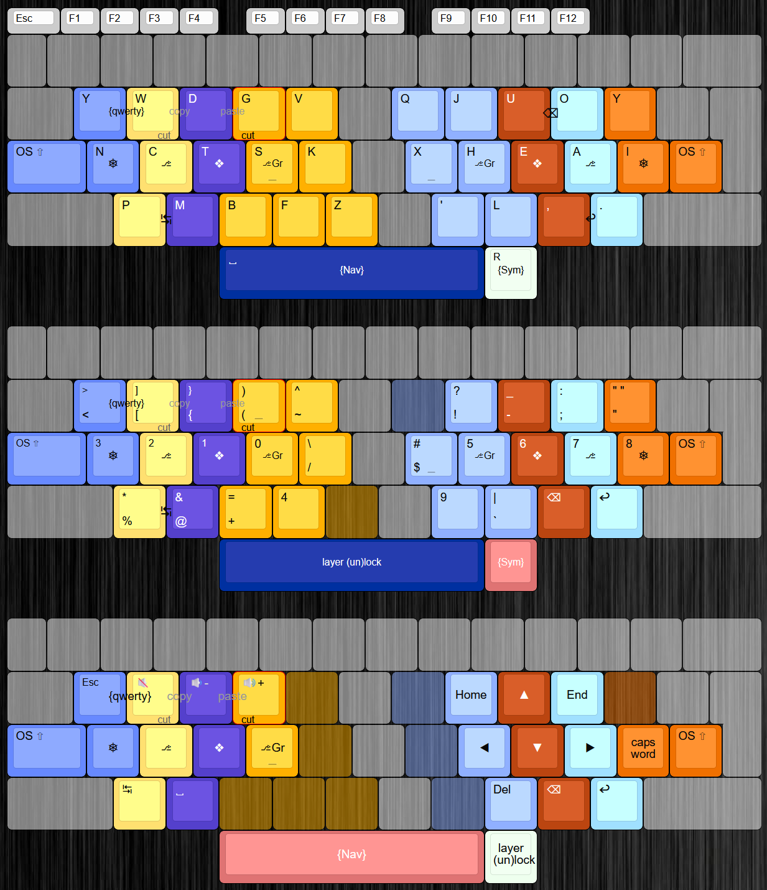

# NeonAKL
Neon is a keyboard layout originally by Turtlyn, adapted to kanata by Samuel / Borrasca.

```
    y w d g v  q j u o y 
OS⇧ n c t s k  x h e a i OS⇧
     p m b f z  ' l , . 
         ␣        r
```

Notes:\
• thumb r\
• mirrored Y: if these are pressed in sequence and overlap, only one Y is output\
• one shot shift on outer pinkies\
• home row mods\
• combos for backspace, tab and enter on base layer\
• combos for qwerty layer, cut, copy and paste on all layers\
• hold y- w combo to switch from neon to qwerty, tap the same combo to switch from qwerty to neon
• custom sym layer with tap-holds for shifted keys


